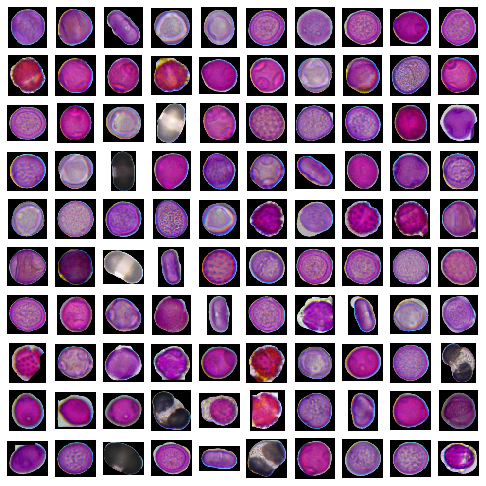

# Pollen Dataset



## Dataset Description
Object dataset for pollen classification.

## Dataset Structure
```
├── samples     
│   ├── Acer    
│   ├── Alnus   
│   ├── ...     
│   └── Urtica
│       ├── Urtica (1).jpg
│       ├── ...
│       └── Urtica (100).jpg
├── objects_clean  
│   ├── Acer    
│   ├── Alnus   
│   ├── ...     
    └── Urtica
        ├── Urtica (114)_0.png
        ├── Urtica (128)_1.png
        ├── ...
        └── Urtica (131)_0.png
├── Prepare Single Object Dataset.ipynb
├── README.md   
└── stats.py
```
The dataset consists of two folders: *samples*, the original images of the tape, divided by plant species, and the *objects_clean* folder with objects also divided by plant species (after additional manual filtering).

## Usage Instructions
To use this dataset, navigate to the samples folder for the original images or objects_clean folder for the single object images.

To repeat the algorithm of dividing samples into separate objects, you can use notebook ```Prepare Single Object Dataset.ipynb``` (Note the need to tune parameters for certain plant species).

The script ```stats.py``` also outputs the total number of images in each dataset folder.

The output of script:
```
./samples/Ambrosia images: 120 jpg
./samples/Urtica images: 140 jpg
./samples/Populus tremula images: 58 jpg
./samples/Tilia images: 80 jpg
./samples/Poaceae images: 44 jpg
./samples/Salix images: 74 jpg
./samples/Plantago images: 38 jpg
./samples/Acer images: 104 jpg
./samples/Artemisia images: 63 jpg
./samples/Picea images: 83 jpg
./samples/Corylus images: 53 jpg
./samples/Betula images: 51 jpg
./samples/Chenopodiaceae images: 89 jpg
./samples/Fraxinus images: 69 jpg
./samples/Apiaceae images: 71 jpg
./samples/Quercus images: 58 jpg
./samples/Pinus images: 57 jpg
./samples/Alnus images: 64 jpg
./samples/Rumex images: 42 jpg
./samples total images: 1358
----------
./objects_clean/Ambrosia images: 148 png
./objects_clean/Urtica images: 42 png
./objects_clean/Populus tremula images: 210 png
./objects_clean/Tilia images: 113 png
./objects_clean/Poaceae images: 52 png
./objects_clean/Salix images: 233 png
./objects_clean/Plantago images: 113 png
./objects_clean/Acer images: 316 png
./objects_clean/Artemisia images: 242 png
./objects_clean/Picea images: 96 png
./objects_clean/Corylus images: 145 png
./objects_clean/Betula images: 205 png
./objects_clean/Chenopodiaceae images: 150 png
./objects_clean/Fraxinus images: 186 png
./objects_clean/Apiaceae images: 130 png
./objects_clean/Quercus images: 88 png
./objects_clean/Pinus images: 67 png
./objects_clean/Alnus images: 103 png
./objects_clean/Rumex images: 98 png
./objects_clean total images: 2737
----------
. total images: 4095
```

## Related Items
Publications: [Link to any publications based on this dataset]